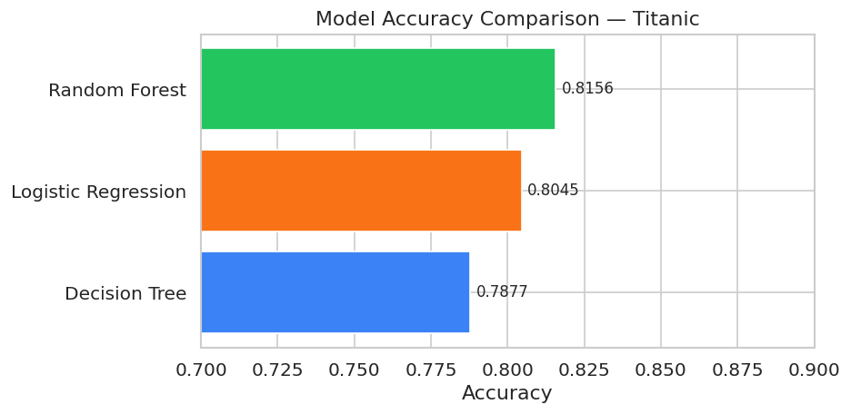

# AnalystLab Africa — Machine Learning Internship

A structured machine learning internship program by AnalystLab Africa.
This repository documents my weekly progress, code, and findings.

---

## 📁 Repository Structure

| Week | Topic | Folder |
|---|---|---|
| Week 1-2 | Data Preprocessing & EDA | `week1-2-eda/` |
| Week 3 | Machine Learning Fundamentals | `week3-ml-fundamentals/` |

---

## Week 1-2: Data Preprocessing & EDA
**Datasets:** Titanic | IMDB 50K Reviews  
**Notebook:** [EDA_Notebook.ipynb](week1-2-eda/EDA_Notebook.ipynb)

### Key Findings
- Women on the Titanic survived at 74% vs 19% for men
- IMDB dataset is perfectly balanced — 25,000 positive, 25,000 negative
- Cabin column dropped (77% missing); Age imputed with median

---

## Week 3: Machine Learning Fundamentals
**Datasets:** Titanic | IMDB 50K Reviews  
**Notebook:** [Week3_ML_Fundamentals.ipynb](week3-ml-fundamentals/Week3_ML_Fundamentals.ipynb)

### Key Results
| Model | Accuracy |
|---|---|
| Logistic Regression | 80.45% |
| Decision Tree (depth=4) | 78.77% |
| Random Forest | 81.56% |
| IMDB Sentiment (TF-IDF + LR) | 86.40% |

---

## 🛠 Tools & Libraries
Python · Pandas · NumPy · Scikit-learn · Matplotlib · Seaborn · Jupyter

## ▶ How to Run
1. Clone the repo: `git clone https://github.com/YOUR_USERNAME/analystlab-ml-internship.git`
2. Install dependencies: `pip install -r requirements.txt`
3. Open any notebook in Jupyter and run all cells

## 📂 Data Sources
- [Titanic Dataset — Kaggle](https://www.kaggle.com/datasets/yasserh/titanic-dataset)
- [IMDB 50K Reviews — Kaggle](https://www.kaggle.com/datasets/lakshmi25npathi/imdb-dataset-of-50k-movie-reviews)