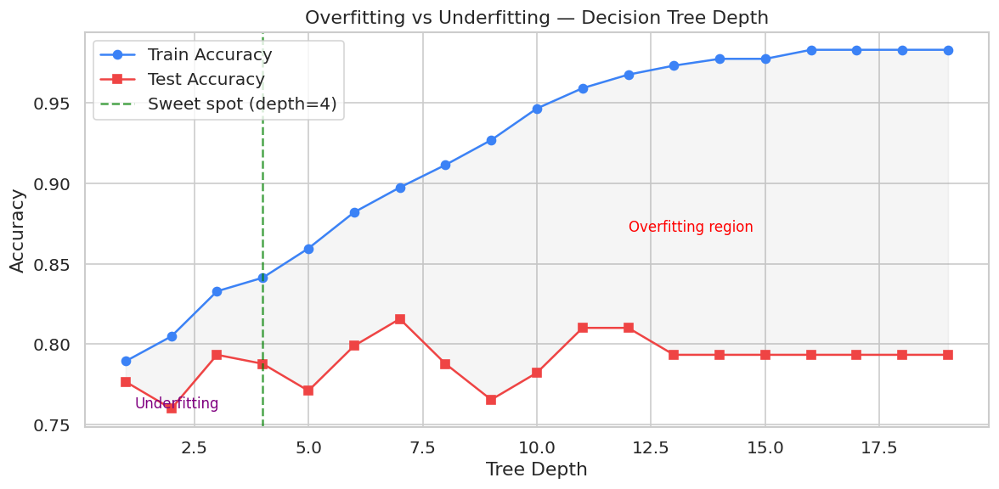
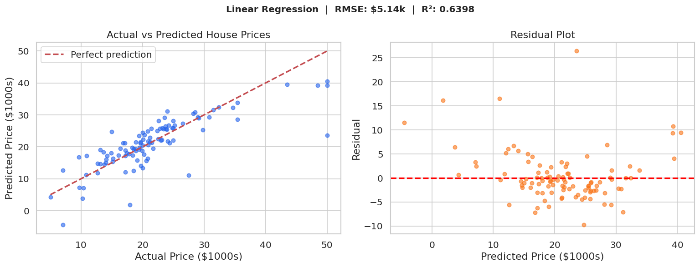
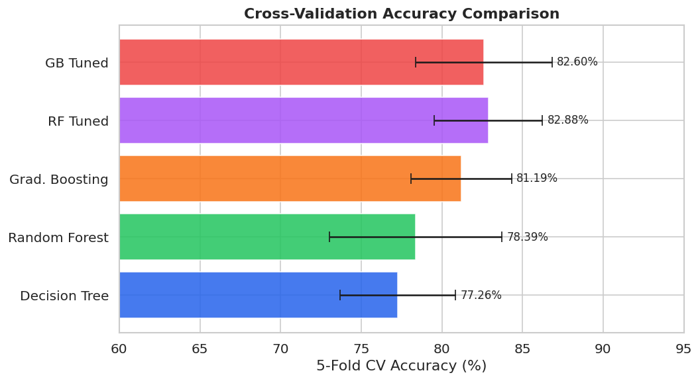
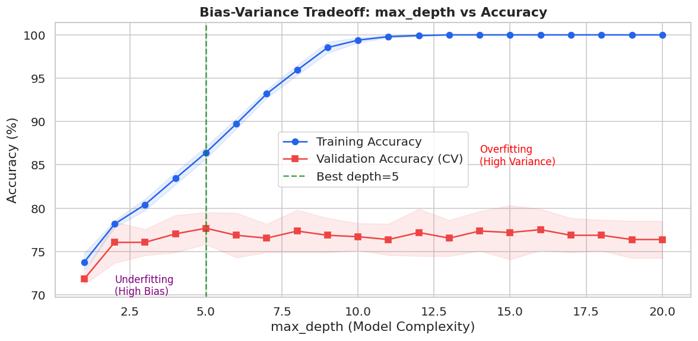

# AnalystLab Africa — Machine Learning Internship


Documenting my weekly progress through the AnalystLab Africa
Machine Learning Internship Program.

---

## 📁 Weekly Progress

| Week | Topic | Folder | Status |
|---|---|---|---|
| Week 1-2 | Data Preprocessing & EDA | `week1-2-eda/` | ✅ Complete |
| Week 3 | Machine Learning Fundamentals | `week3-ml-fundamentals/` | ✅ Complete |
| Week 4 | Supervised Learning | `week4-supervised-learning/` | ✅ Complete |
| Week 5 | Advanced Machine Learning | `week5-advanced-ml/` | ✅ Complete |
| Week 6 | Model Tuning & Validation | `week6-model-tuning/` | ✅ Complete |
| Week 7 | Model Deployment | `Week-7-deployment/` | ✅ Complete |

---

## Week 1-2: Data Preprocessing & EDA
**Notebook:** [EDA_Notebook.ipynb](week1-2-eda/EDA_Notebook.ipynb)
**Datasets:** Titanic | IMDB 50K Reviews

Women on the Titanic survived at 74% vs 19% for men. IMDB dataset is perfectly balanced — 25,000 positive, 25,000 negative.


---

## Week 3: Machine Learning Fundamentals
**Notebook:** [Week3_ML_Fundamentals.ipynb](week3-ml-fundamentals/Week3_ML_Fundamentals.ipynb)

| Model | Accuracy |
|---|---|
| Logistic Regression | 80.45% |
| Random Forest | 81.56% |
| IMDB Sentiment (TF-IDF + LR) | 86.40% |



---

## Week 4: Supervised Learning
**Notebook:** [Week4_Supervised_Learning.ipynb](week4-supervised-learning/Week4_Supervised_Learning.ipynb)

**Linear Regression (Boston Housing):** RMSE $5.14k, R² 0.64
**Logistic Regression (Titanic):** Accuracy 80.45%



---

## Week 5: Advanced Machine Learning
**Notebook:** [Week5_Advanced_ML.ipynb](week5-advanced-ml/Week5_Advanced_ML.ipynb)

| Model | CV Accuracy |
|---|---|
| Decision Tree | 77.26% |
| Random Forest | 78.39% |
| Gradient Boosting | 81.19% |
| RF Tuned (GridSearch) | 82.88% |



---

## Week 6: Model Tuning & Validation
**Notebook:** [Week6_Model_Tuning_Validation.ipynb](week6-model-tuning/Week6_Model_Tuning_Validation.ipynb)
**Dataset:** Pima Indians Diabetes Database

| Model | CV Accuracy |
|---|---|
| Baseline (Random Forest) | 76.38% ± 2.14% |
| Grid Search Tuned | 78.01% ± 2.58% |
| Random Search Tuned | 78.18% ± 2.38% |

Cross-validation accuracy improved after tuning even though single test-set accuracy dropped — CV is the reliable selection metric.



---

## Week 7: Model Deployment
**Source code:** [Week-7-deployment/app.py](Week-7-deployment/app.py)
**Documentation:** [API_DOCUMENTATION.md](Week-7-deployment/API_DOCUMENTATION.md)

The Week 6 tuned Random Forest model was deployed as a REST API using Flask. The model, scaler, and imputer are saved with `joblib` and loaded at startup, so predictions run without retraining.

**Endpoints:**
| Endpoint | Method | Purpose |
|---|---|---|
| `/` | GET | API info |
| `/health` | GET | Status check |
| `/model-info` | GET | Model metrics and feature details |
| `/predict` | POST | Send patient data, get a diabetes risk prediction |

**Example prediction:** a patient profile with Glucose=148, BMI=33.6, Age=50 returns `"prediction_label": "Diabetes"` with 67.9% probability.

Run locally:
```bash
cd Week-7-deployment
pip install -r requirements.txt
python app.py
```

---

## 🛠 Tools & Libraries
Python · Pandas · NumPy · Scikit-learn · Matplotlib · Seaborn · Jupyter · Flask · Joblib

## ▶ How to Run
1. Clone: `git clone `
2. Install: `pip install -r requirements.txt`
3. Open any notebook in Jupyter and run all cells, or see Week 7 for the deployed API

## 📂 Data Sources
- [Titanic — Kaggle](https://www.kaggle.com/datasets/yasserh/tihttps://github.com/vincent777756/Analystlab-ml-internship.gittanic-dataset) — included
- [IMDB 50K Reviews — Kaggle](https://www.kaggle.com/datasets/lakshmi25npathi/imdb-dataset-of-50k-movie-reviews) — not included (60MB), download and run notebook to regenerate
- [Boston Housing — GitHub](https://raw.githubusercontent.com/selva86/datasets/master/BostonHousing.csv) — included
- [Pima Indians Diabetes — Kaggle](https://www.kaggle.com/datasets/uciml/pima-indians-diabetes-database) — included