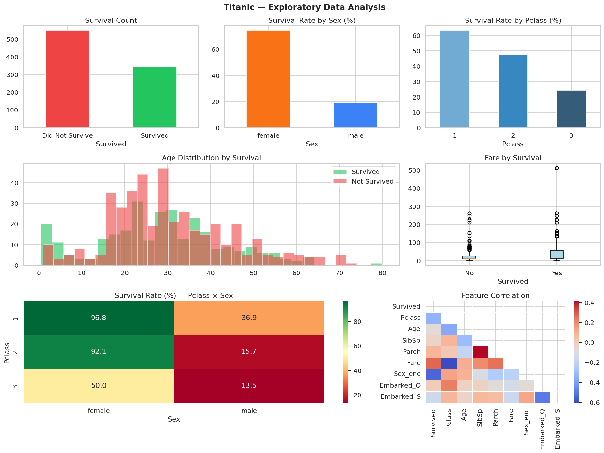
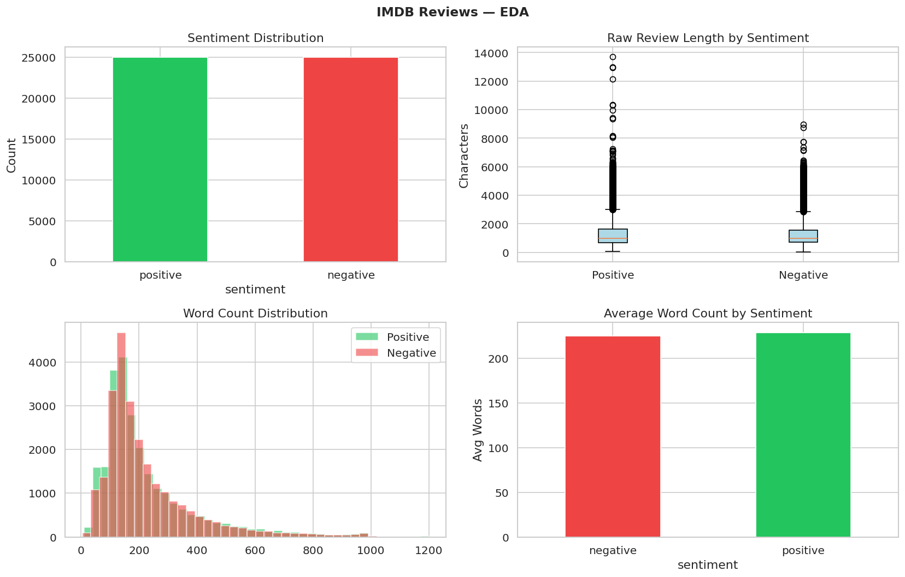

# AnalystLab Africa ML Internship — Week 1-2
## Data Preprocessing & Exploratory Data Analysis

### Datasets
- [Titanic Dataset](https://www.kaggle.com/datasets/yasserh/titanic-dataset) — 891 rows, 12 features
- [IMDB Reviews Dataset](https://www.kaggle.com/datasets/lakshmi25npathi/imdb-dataset-of-50k-movie-reviews) — 50,000 reviews

### Tools Used
Python · Pandas · NumPy · Matplotlib · Seaborn · Scikit-learn

### Key Findings
- Women on the Titanic survived at 74% vs. 19% for men
- 1st class passengers had 63% survival vs. 24% in 3rd class
- IMDB dataset is perfectly balanced (50/50 positive/negative)

### EDA Visuals

### How to Run
1. Clone the repo
2. Install requirements: `pip install -r requirements.txt`
3. Open `EDA_Notebook.ipynb` in Jupyter
